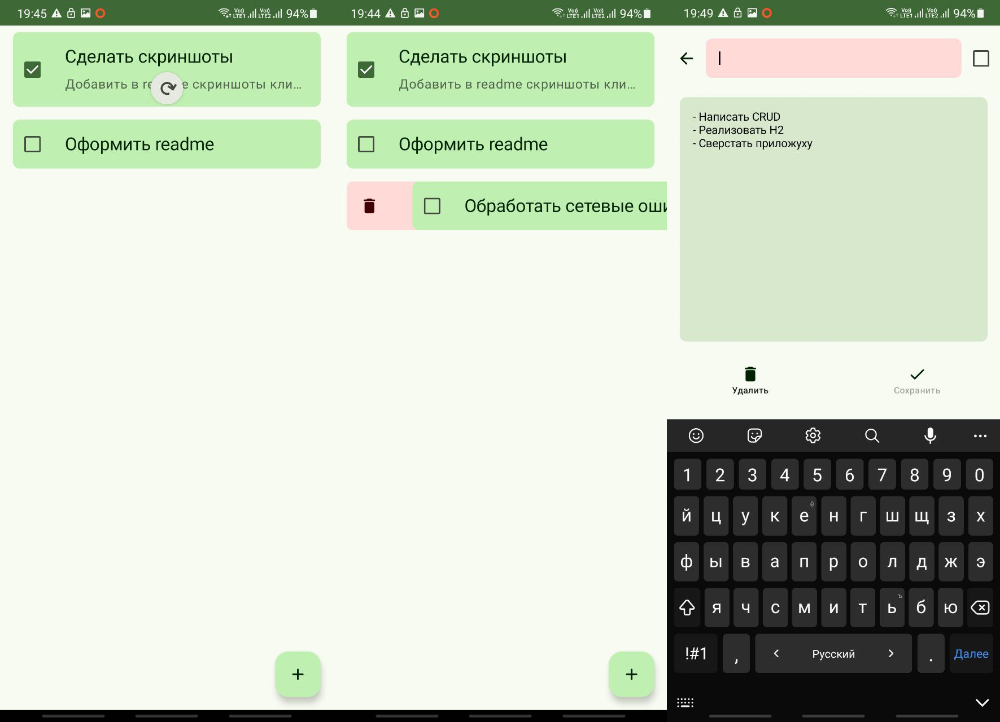

# :page_with_curl: TODO App

Client-server app that provides CRUD for notes.

**Tech stack:**
- **Server-side**: Spring Boot, Kotlin, H2 and Liquibase.
- **Client-side**: Android SDK, Kotlin, Retrofit, Jetpack Compose, Paging and Hilt.

## :package: Deploy
First of all, you have to install JDK 17.

**Build both client and server:**
1. Define `server.base.url` in `dev.properties` (only Android subproject uses this property).
2. Run composite build `./gradlew build`.
3. Go to `/build` (here you can find server-app as `.jar` and Android as `.apk`).

**Deploy only server:** 
- Go to `server` folder and run `./gradlew bootRun --args="--server.address=192.168.0.10 --server.port=8080 --db.h2.address=jdbc:h2:./todo"` (replace arguments).
- Or you can just build `.jar` by executing `./gradlew bootJar` (it will be located in `build/libs`).

**Build only Android app:**
- Go to `client-android` and run `./gradlew assembleDebug` (`.apk` locates in `app/build/outputs/apk/debug`)

**Deploy server from `.jar`**:
- `java -jar <server>.jar --server.address=<address> --server.port=<port> --db.h2.address=jdbc:h2:./<embedded-db>` (omit args if you wanna use default values from `dev.properties` defined at compile time).

**Clean Android project**:
- I would recommend to execute `gradlew client-android:app:clean` each time you change `dev.properties`, cause' sometimes BuildConfig doesn't update base url.

**Migrations**:
- Go to `server` folder and run `./gradlew update "-Pdb.h2.address=jdbc:h2:<path-to-embedded-db>"` to update db scheme.
- Run `./gradlew dropAll "-Pdb.h2.address=jdbc:h2:<path>"` to reset db (omit argument to use value from top-level properties).